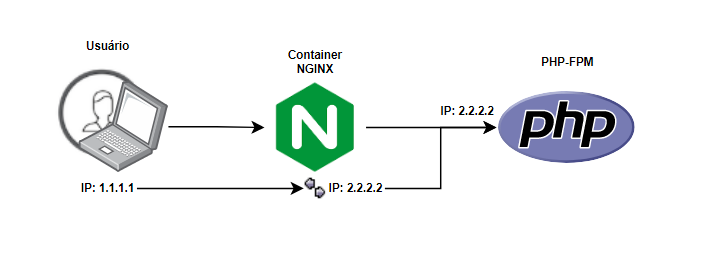

> ## Repository in order to solve a problem where the REAL IP does not reach the PHP-FPM log.
>
>
>What happens is that when going through different IPs, like when doing a **PROXY**, only the **X-Forwarded-For** header may not work correctly,
> for that, in my configuration of **[custom-phpfpm.conf](https://github.com/Zellds/forward-real-ip-nginx/blob/dd90a7f36bdb3966c3c09d7cb80f5ae950699880/docker/php-fpm/custom-phpfpm.conf)**
> it was necessary in the log format, to add a parameter to be able to extract the correct information.
> 
> * In this case **``%{HTTP_X_REAL_IP}e``** leaving my complete log formatting as follows: **[file](https://github.com/Zellds/forward-real-ip-nginx/blob/dd90a7f36bdb3966c3c09d7cb80f5ae950699880/docker/php-fpm/custom-phpfpm.conf)**
>
>```ini
>[global]
>error_log = /var/log/phplog/fpm-error.log
>
>[www]
>access.log = /var/log/phplog/fpm-access.log
>access.format = "%t \"%m %r%Q%q\"%{HTTP_X_REAL_IP}e"
>catch_workers_output = yes
> ```
> Now checking the log, it should already contain the correct information.
>
>For other variables: [here](http://nginx.org/en/docs/varindex.html)
> #
> Remembering that **X-Forwarded-For** will not be removed from your
 **[site.conf](https://github.com/Zellds/forward-real-ip-nginx/blob/dd90a7f36bdb3966c3c09d7cb80f5ae950699880/docker/nginx/site.conf)**, if it doesn't work, try to add the parameter.
>* **``fastcgi_param HTTP_CLIENT_IP  $http_x_real_ip;``** 
> 
>as in the following example: **[file](https://github.com/Zellds/forward-real-ip-nginx/blob/dd90a7f36bdb3966c3c09d7cb80f5ae950699880/docker/nginx/site.conf)**
>
>```sh
>server {
>        listen 8080;
>        server_name localhost;
>        root /app;
>        index index.php;
>
>        error_log /var/log/nginx/server-error.log;
>        access_log /var/log/nginx/server-access.log custom_log;
>
>        ## important that you keep these headers
>        proxy_set_header   X-Forwarded-For $proxy_add_x_forwarded_for;
>        proxy_set_header   X-Real-IP       $remote_addr;
>
>        location / {
>                try_files $uri $uri/index.php;
>            }
>
>        location ~ \.php$ {
>            ## add this parameter in your PHP-FPM
>            fastcgi_param HTTP_CLIENT_IP  $http_x_real_ip;  
>            include fastcgi_params;
>            try_files $fastcgi_script_name = 404;
>            fastcgi_pass phpfpm:9000;
>            fastcgi_index index.php;
>            fastcgi_param SCRIPT_FILENAME $document_root$fastcgi_script_name;
>     }
>}
>```
> #
> ### Before:
>
>
> ### After:
>
