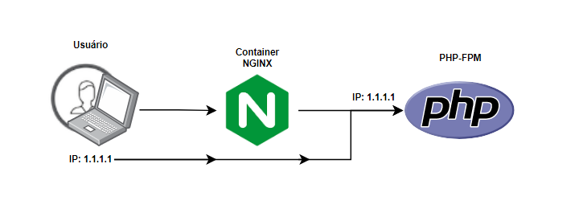

> ## Repository in order to solve a problem where the REAL IP does not reach the PHP-FPM log.
>
>
>What happens is that when going through different IPs, like when doing a **PROXY**, only the **X-Forwarded-For** header may not work correctly,
> for that, in my configuration of **[custom-phpfpm.conf](https://github.com/Zellds/forward-real-ip-nginx/blob/dd90a7f36bdb3966c3c09d7cb80f5ae950699880/docker/php-fpm/custom-phpfpm.conf)**
> it was necessary in the log format, to add a parameter to be able to extract the correct information.
> 
>> In this case **``%{HTTP_X_REAL_IP}e``** leaving my complete log formatting as follows:
>>
>> * **``access.format = "%t \"%m %r%Q%q\"%{HTTP_X_REAL_IP}e"``** 
>>
>> as in the following example: **[file](https://github.com/Zellds/forward-real-ip-nginx/blob/dd90a7f36bdb3966c3c09d7cb80f5ae950699880/docker/php-fpm/custom-phpfpm.conf)**
> 
> 
> Now checking the log, it should already contain the correct information.
> #
> Remembering that **X-Forwarded-For** will not be removed from your
 **[site.conf](https://github.com/Zellds/forward-real-ip-nginx/blob/dd90a7f36bdb3966c3c09d7cb80f5ae950699880/docker/nginx/site.conf)**, if it doesn't work, try to add the parameter.
>* **``fastcgi_param HTTP_CLIENT_IP  $http_x_real_ip;``** 
> 
>as in the following example: **[file](https://github.com/Zellds/forward-real-ip-nginx/blob/dd90a7f36bdb3966c3c09d7cb80f5ae950699880/docker/nginx/site.conf)**
> 
> #
> ### Before:
>
>
> ### After:
>